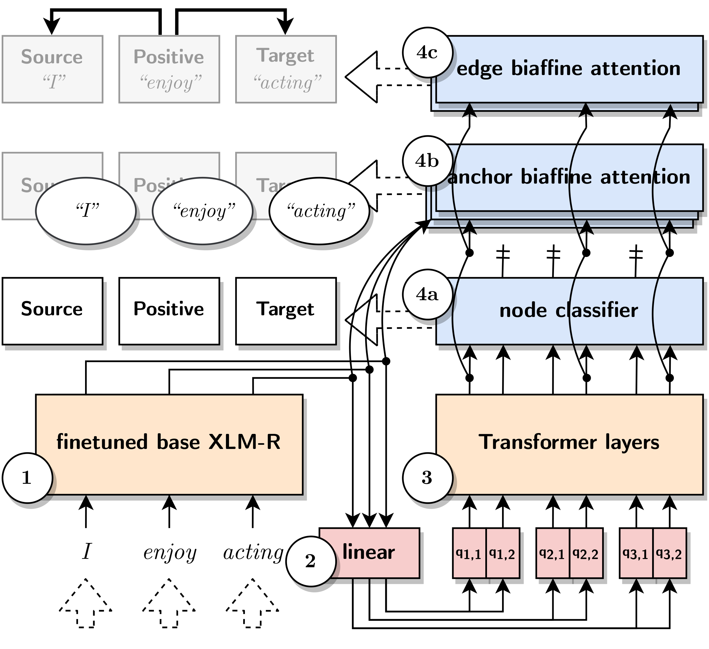

<h1 align="center"><b>Direct parsing to sentiment graphs</b></h1>

<p align="center">
  <i><b>David Samuel, Jeremy Barnes, Robin Kurtz, Stephan Oepen, Lilja Øvrelid and Erik Velldal</b></i>
</p>

<p align="center">
  <i>
    University of Oslo, Language Technology Group<br>
    University of the Basque Country UPV/EHU, HiTZ Center – Ixa<br>
    National Library of Sweden, KBLab
  </i>
</p>
<br>

<p align="center">
  <a href="https://arxiv.org/abs/2203.13209"><b>Paper</b></a><br>
  <a href="TODO"><b>Pretrained models</b></a><br>
  <a href="TODO"><b>Interactive demo on Google Colab</b></a>
</p>

<p align="center">
    
</p>

_______

<br>

This repository provides the official PyTorch implementation of our paper "Direct parsing to sentiment graphs" together with [pretrained *base* models](https://drive.google.com/drive/folders/11ozu_uo9z3wJwKl1Ei2C3aBNUvb66E-2?usp=sharing) for all six datasets (TODO): Darmstadt, MPQA, Multibooked_ca, Multibooked_eu and NoReC.

_______

<br>

## How to run

### :feet: &nbsp; Training

To train PERIN on NoReC, run the following script. Other configurations are located in the `perin/config` folder.
```sh
cd perin
sbatch run.sh config/seq_norec.yaml
```

### :feet: &nbsp; Inference

You can run the inference on the validation and test datasets by running:
```sh
python3 inference.py --checkpoint "path_to_pretrained_model.h5" --data_directory ${data_dir}
```

## Citation

```
@inproceedings{samuel-etal-2022-direct,
    title = "Direct parsing to sentiment graphs",
    author = "Samuel, David  and
      Barnes, Jeremy  and
      Kurtz, Robin  and
      Oepen, Stephan  and
      {\O}vrelid, Lilja  and
      Velldal, Erik",
    booktitle = "Proceedings of the 60th Annual Meeting of the Association for Computational Linguistics (Volume 2: Short Papers)",
    month = may,
    year = "2022",
    address = "Dublin, Ireland",
    publisher = "Association for Computational Linguistics",
    url = "https://aclanthology.org/2022.acl-short.51",
    doi = "10.18653/v1/2022.acl-short.51",
    pages = "470--478",
    abstract = "This paper demonstrates how a graph-based semantic parser can be applied to the task of structured sentiment analysis, directly predicting sentiment graphs from text. We advance the state of the art on 4 out of 5 standard benchmark sets. We release the source code, models and predictions.",
}
```
